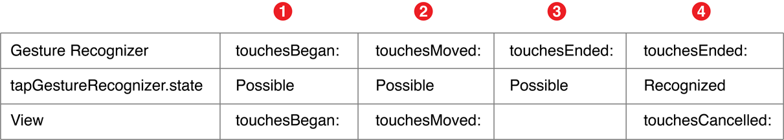

# 手势识别器

教程出自 `RayWenderlich` 的 [UIGestureRecognizer Tutorial: Getting Started](http://www.raywenderlich.com/76020/using-uigesturerecognizer-with-swift-tutorial) 和 [UIGestureRecognizer Tutorial: Creating Custom Recognizers](http://www.raywenderlich.com/104744/uigesturerecognizer-tutorial-creating-custom-recognizers)，前者主要讲解了如何使用各种手势识别器，并介绍了如何自定义手势识别器，后者深入讲解了如何自定义手势识别器。附上后一篇教程的 [中文翻译传送门](http://blog.csdn.net/mmoaay/article/details/47355709)。

原文很大篇幅都在讲解识别一个圆的算法以及一些细节完善，这里主要进行一下总结。

参考文档 [Event Handling Guide for iOS](https://developer.apple.com/library/ios/documentation/EventHandling/Conceptual/EventHandlingiPhoneOS/Introduction/Introduction.html#//apple_ref/doc/uid/TP40009541-CH1-SW1) 之 [Gesture Recognizers](https://developer.apple.com/library/ios/documentation/EventHandling/Conceptual/EventHandlingiPhoneOS/GestureRecognizer_basics/GestureRecognizer_basics.html#//apple_ref/doc/uid/TP40009541-CH2-SW2)。

- [手势识别器的多种状态](#Gesture_Recognizers_Operate_in_a_Finite_State_Machine)
- [手势识别器间的相互影响](#Interacting_with_Other_Gesture_Recognizers)
- [手势识别器和某些控件间的相互影响](#Interacting_with_Other_User_Interface_Controls)
- [触摸事件的表示与传递](#Touch-Handling_Methods_&_UITouch)
- [手势识别器优先于所属视图处理触摸事件](#Gesture_Recognizers_Get_the_First_Opportunity_to_Recognize_a_Touch)
- [改变触摸事件的派发时机](#Affecting_the_Delivery_of_Touches_to_Views)
- [自定义手势识别器](#Creating_a_Custom_Gesture_Recognizer)

<a name="Gesture_Recognizers_Operate_in_a_Finite_State_Machine"></a>
## 手势识别器的多种状态

手势识别器具有多种状态，通过 `state` 属性表示，根据手势是否是连续型手势（例如拖拽手势），这些状态又有所不同，如下图所示：


`state` 属性是个枚举类型，具体如下：

```swift
enum UIGestureRecognizerState : Int {
    case Possible  // 手势识别器的初始状态，此时手势尚未识别，接下来可能会被识别，也可能识别失败，即进入 Failed 状态。
    case Began     // 连续型手势才有此状态，例如拖拽手势。此时手势已识别，在下个运行循环，会调用绑定的方法。
    case Changed   // 同样，只有连续型手势才有此状态。在下个运行循环，会调用绑定的方法。
    case Ended     // 手势结束，在下个运行循环，会调用绑定的方法，并且手势的状态会重置为 Possible 状态。
    case Cancelled // 手势被取消，只针对连续型手势。在下个运行循环，会调用绑定的方法，并且手势的状态会重置为 Possible 状态。
    case Failed    // 手势识别失败，绑定的方法不会被调用，只会将手势的状态重置为 Possible 状态。
    
    // 该状态只针对非连续型手势，例如轻击手势。非连续型手势没有 Began，Changed 和 Cancelled 状态。
    // 在 Objective-C 头文件中，该状态其实等同于 Ended 状态。
    // 因此，此时手势结束，在下个运行循环，会调用绑定的方法，并且手势识别器的状态会重置为 Possible 状态。
    public static var Recognized: UIGestureRecognizerState { get }
    
    // 综上所述，手势识别器进入 Began，Changed，Ended/Recognized，Cancelled 这几个状态时，均会调用绑定的方法，
    // 而被重置为 Possible 状态或进入 Failed 状态时，则不会调用绑定的方法。
}
```

<a name="Interacting_with_Other_Gesture_Recognizers"></a>
## 手势识别器间的相互影响

手势识别器需绑定到 `UIView` 上，同一个 `UIView` 可以绑定多个手势识别器，但每个手势识别器只能对应一个 `UIView`。可以通过 `UIView` 的 `addGestureRecognizer(_:)` 方法绑定一个手势识别器，通过 `removeGestureRecognizer(_:)` 方法移除手势识别器，通过 `gestureRecognizers` 属性获取其绑定的所有手势识别器。

对于同一个 `UIView` 上的一系列手势识别器，手势识别器会优先于 `UIView` 处理触摸事件。默认情况下，各个手势识别器处理触摸事件的顺序并无保证。但是可以通过 `UIGestureRecognizer` 的一些实例方法，代理方法，或是一些供子类化的方法来定义手势识别器的一些行为：

- 指定两个手势识别器间的识别顺序。
- 允许两个手势识别器同时工作。
- 禁止某个手势识别器处理某个触摸事件。
- 单方面指定手势识别器间的关系。

### 指定两个手势识别器间的识别顺序

可以通过 `requireGestureRecognizerToFail(_:)` 方法让一个手势识别器必须在指定手势识别器识别失败的情况才能开始处理触摸事件。

例如，如果同时存在单击和双击手势识别器，默认情况下，一次双击操作也会触发单击手势识别器。为了避免这种行为，可以让单击手势识别器必须在双击手势识别器识别失败的情况下才能开始处理：

```swift
singleTapGR.requireGestureRecognizerToFail(doubleTapGR) 
```

需要注意的是，这会造成单击手势响应有短暂延迟，因为必须等待双击手势识别失败。

### 允许两个手势识别器同时工作

默认情况下，两个手势识别器无法同时工作，例如捏合和旋转手势默认无法同时进行。若想让两个手势识别器同时工作，成为其中一个手势识别器的代理，实现如下代理方法即可：

```swift
func gestureRecognizer(gestureRecognizer: UIGestureRecognizer, 
    shouldRecognizeSimultaneouslyWithGestureRecognizer otherGestureRecognizer: UIGestureRecognizer) -> Bool {
    return true
}
```

只要为其中一个手势识别器实现此代理方法即可，这也意味着，即使返回 `false`，也不能有效禁止两个手势识别器同时工作，因为另一个手势识别器的代理有可能返回了 `true`。

### 禁止某个手势识别器处理某个触摸事件

可以通过 `UIGestureRecognizerDelegate` 中声明的如下代理方法禁止某个手势识别器处理触摸事件：

```swift
func gestureRecognizerShouldBegin(gestureRecognizer: UIGestureRecognizer) -> Bool {
    return false
}
```

当触摸事件发生，手势识别器处于 `Possible` 状态时，此代理方法就会被调用。如果返回 `false`，手势识别器会直接进入 `Failed` 状态，如前所述，此时手势识别器绑定的方法也就不会调用了。`UIView` 也有同名实例方法，不方便作为手势识别器的代理时可以通过重写方法来实现同样效果。

下面这个代理方法则更彻底一些，如果返回 `false`，手势识别器会完全忽略这次触摸事件：

```swift
func gestureRecognizer(gestureRecognizer: UIGestureRecognizer, shouldReceiveTouch touch: UITouch) -> Bool {
    return false
}
```

### 单方面指定手势识别器间的关系

`UIGestureRecognizer` 提供了如下方法，可以通过子类化来进行重写，从而单方面指定手势识别器间的关系：

```swift
func canPreventGestureRecognizer(preventedGestureRecognizer: UIGestureRecognizer) -> Bool
func canBePreventedByGestureRecognizer(preventingGestureRecognizer: UIGestureRecognizer) -> Bool
func shouldRequireFailureOfGestureRecognizer(otherGestureRecognizer: UIGestureRecognizer) -> Bool
func shouldBeRequiredToFailByGestureRecognizer(otherGestureRecognizer: UIGestureRecognizer) -> Bool
```

例如，单击手势不应阻止双击手势，旋转手势应该阻止捏合手势等等。

<a name="Interacting_with_Other_User_Interface_Controls"></a>
## 手势识别器和某些控件间的相互影响

iOS 6 之后，一些 UI 控件会覆盖掉手势识别器。例如，对于 `UIButton`，如果往其父视图添加轻击手势识别器，点击按钮的位置，只会触发按钮的方法，并不会触发轻击手势识别器。

- `UIButton`，`UISwitch`，`UIStepper`，`UISegmentedControl`，`UIPageControl` 会覆盖自身范围内的单指轻击手势。
- `UISlider` 会覆盖滑块范围内的和滑块滑动方向相同的单指拖拽手势。
- `UISwitch` 会覆盖开关范围内的和开关方向相同的单指拖拽手势。

根据文档建议，可以将手势识别器直接添加到控件上，而不是父视图上，但是这样会覆盖控件原有的功能。

<a name="Touch-Handling_Methods_&_UITouch"></a>
## 触摸事件的表示与传递

当用户用手指触摸屏幕时，触摸事件开始，当最后一根手指离开屏幕时，触摸事件结束。触摸事件被封装为 `UITouch` 对象，每根手指对应一个。系统会实时跟踪触摸事件，并及时更新 `UITouch` 对象来反映当前触摸事件。在触摸过程中，系统通过 `UIResponder` 中定义的如下四个方法沿着响应链来传递触摸事件：

```swift
func touchesBegan(touches: Set<UITouch>, withEvent event: UIEvent)     // 当一根或多根手指触摸屏幕时调用
func touchesMoved(touches: Set<UITouch>, withEvent event: UIEvent)     // 当一根或多根手指保持触屏幕并移动时调用
func touchesEnded(touches: Set<UITouch>, withEvent event: UIEvent)     // 当一根或多根手指离开屏幕时调用
func touchesCancelled(touches: Set<UITouch>, withEvent event: UIEvent) // 当触摸事件被系统事件打断时调用，例如电话呼入
```

每一个方法对应一个触摸阶段，相应的，`UITouch` 对象也分为不同触摸阶段，通过 `phase` 属性表示：

```swift
enum UITouchPhase : Int {
    case Began 
    case Moved 
    case Stationary // 手指触摸着屏幕，但从上次事件开始还未移动
    case Ended 
    case Cancelled 
}
```

需要注意的是，这些方法和手势识别器的各种状态并无必然联系，例如 `touchesBegan(_:withEvent:)` 方法未必就对应手势识别器的 `Began` 状态，手势识别器的各种状态仅仅表示手势识别器本身的状态。


<a name="Gesture_Recognizers_Get_the_First_Opportunity_to_Recognize_a_Touch"></a>
## 手势识别器优先于所属视图处理触摸事件

前面提到过，手势识别器会优先于所属的视图来处理触摸事件，如下图所示：


触摸事件发生时，`UIApplication` 对象会将表示触摸事件的 `UITouch` 对象派发给窗口，然后进一步沿响应链向下派发。在这个过程中，视图绑定的手势识别器会先于视图本身处理触摸事件。一旦手势识别器识别成功，触摸事件将不会进一步派发给手势识别器所属的视图，并会取消先前派发给视图的触摸事件，即向视图发送 `touchesCancelled(_:withEvent:)` 消息。

例如，对于一个用于识别双指轻击的非连续型手势而言，双指轻击发生后，`UIApplication` 对象会将事件派发到窗口，进而派发到被触摸的视图关联的手势识别器以及该视图本身。这个过程如下图所示：



1. 窗口将两个处于 `Began` 阶段的 `UITouch` 对象通过 `touchesBegan(_:withEvent:)` 方法派发给被触摸视图的手势识别器，此时手势识别器尚未识别出该手势，因此状态还处于 `Possible`。接着，窗口将这两个对象派发给手势识别器所属的视图。

2. 窗口将两个处于 `Move` 阶段（用户手指轻微移动）的 `UITouch` 对象通过 `touchesMoved(_:withEvent:)` 方法派发给手势识别器，此时手势识别器依然尚未识别出该手势，因此状态还是 `Possible`，于是窗口进一步将这两个对象派发给视图。

3. 窗口将一个处于 `Ended` 阶段的 `UITouch` 对象通过 `touchesEnded(_:withEvent:)` 方法派发给手势识别器，此时手势识别器还是缺乏足够的信息来识别手势，因此状态还是 `Possible`。但是，这一次窗口并没有继续向视图派发该对象，而是将其扣留了。

4. 窗口将另一个处于 `Ended` 阶段的 `UITouch` 对象通过 `touchesEnded(_:withEvent:)` 方法派发给手势识别器。此时手势识别器终于收集到了足够的信息，识别了这个双指轻击手势，因此状态进入 `Recognized`。接着，窗口向视图发送 `touchesCancelled(_:withEvent:)` 消息，取消了视图对这次双指轻击触摸事件的处理。也就是说，视图只收到了 `touchesBegan(_:withEvent:)` 和 `touchesMoved(_:withEvent:)` 消息，经过短暂的等待，视图并没有等到被扣留的 `touchesEnded(_:withEvent:)` 消息，最终只会收到 `touchesCancelled(_:withEvent:)` 消息。因此对于视图来说，这次触摸事件的处理被取消了。

假如手势识别器在最后还是没有识别出手势，由 `Possible` 状态转为 `Failed` 状态，那么窗口此时才会将两个处于 `Ended` 阶段的 `UITouch` 对象通过 `touchesEnded(_:withEvent:)` 方法派发给视图。

上面举的是非连续型手势的例子，连续型手势与之类似，不过手势识别器可能会在触摸过程进入 `Ended` 阶段前就识别出手势。一旦手势识别，手势识别器就会由 `Possible` 状态进入 `Began` 状态，然后继续之后的一系列状态。

<a name="Affecting_the_Delivery_of_Touches_to_Views"></a>
## 改变触摸事件的派发时机

`UIGestureRecognizer` 提供了如下三个属性，可以改变上面所述的派发过程：

- `delaysTouchesBegan`（默认为 `false`）：默认情况下，窗口会将处于 `Began` 和 `Move` 阶段的 `UITouch` 对象派发给手势识别器及其所属的视图。若开启此属性，在手势识别前，窗口将不会派发 `UITouch` 对象给视图。因此，一旦手势识别，视图也不会收到 `touchesCancelled(_:withEvent:)` 消息，也就是说，视图在触摸过程中不会收到任何消息。只有手势最终识别失败，窗口才会将扣留的 `UITouch` 对象派发给视图。要慎重开启此属性，很可能会导致控件反映迟钝。该属性类似于 `UIScrollView` 的 `delaysContentTouches` 属性，位于 `UIScrollView` 上的控件会反映迟钝，因为需要等待判定完触摸是不是滚动才会有反应。例如，位于 `UIScrollView` 上的 `UIButton` 在快速点击时是没有高亮效果的。

- `cancelsTouchesInView`（默认为 `true`）：默认情况下，手势识别成功后，窗口就会向手势识别器所属的视图发送 `touchesCancelled(_:withEvent:)` 消息取消视图对触摸事件的处理。若关闭此属性，即使手势识别成功，视图也不会被取消处理，而是收到后续消息，例如 `touchesEnded(_:withEvent:)`。

- `delaysTouchesEnded`（默认为 `true`）：默认情况下，在手势识别失败之前，窗口会扣留位于 `Ended` 阶段的 `UITouch` 对象，不会向手势识别器所属的视图发送 `touchesEnded(_:withEvent:)` 消息。一旦手势识别成功，窗口会向视图发送 `touchesCancelled(_:withEvent:)` 消息，取消视图对这次触摸事件的处理。只有手势识别失败时，窗口才会通过 `touchesEnded(_:withEvent:)` 向视图发送扣留的 `UITouch` 对象。如果关闭此属性，无论手势是否失败，窗口都会直接向视图发送 `touchesEnded(_:withEvent:)` 消息，也就是说，视图和手势识别器将同时处理位于 `Ended` 阶段的 `UITouch` 对象。例如，某个视图绑定了一个双击手势识别器，然后用户双击了该视图。当此属性开启时，视图会先收到两次 `touchesBegan(_:withEvent:)` 消息，接着收到两次 `touchesCancelled(_:withEvent:)` 消息。当此属性关闭时，视图接收消息的顺序则为：`touchesBegan(_:withEvent:)`，`touchesEnded(_:withEvent:)`，`touchesBegan(_:withEvent:)`，`touchesCancelled(_:withEvent:)`。

另外，如果手势识别器发现当前触摸事件不是自己需要的，可以通过 `ignoreTouch(_:forEvent:)` 方法忽略掉，这会将触摸事件派发给手势识别器所在的视图，也就意味着视图不会收到 `touchesCancelled(_:withEvent:)` 消息而被取消触摸处理。

<a name="Creating_a_Custom_Gesture_Recognizer"></a>
## 自定义手势识别器

自定义手势识别器时需要导入如下头文件：

```swift
import UIKit.UIGestureRecognizerSubclass
```

这样 `state` 属性才是可读写的，否则是只读的，无法修改。

然后根据需要对如下五个方法进行重写，根据文档建议，一定要调用超类方法：

```swift
func reset()
func touchesBegan(touches: Set<UITouch>, withEvent event: UIEvent)
func touchesMoved(touches: Set<UITouch>, withEvent event: UIEvent)
func touchesEnded(touches: Set<UITouch>, withEvent event: UIEvent)
func touchesCancelled(touches: Set<UITouch>, withEvent event: UIEvent)
```

```swift
override func touchesBegan(touches: Set<UITouch>, withEvent event: UIEvent) {
    super.touchesBegan(touches, withEvent: event)

    /* 例如，对于单点触手势，若发现不合要求，则直接转入 Failed 阶段
    guard touches.count == 1 else {
      state = .Failed
      return
    } 
    */
    
    // 如前所述，进入 Began 阶段后，会触发手势识别器绑定的方法
    // 另外，对于非连续型手势，则不应进入 Began 阶段，而是应该根据需要在适当时机直接进入 Ended 阶段
    state = .Began
    
    // 根据具体需求做些事情。。。
 }
```

```swift
override func touchesMoved(touches: Set<UITouch>, withEvent event: UIEvent) {
    super.touchesMoved(touches, withEvent: event)

    // Apple 建议首先检查手势是否已经失效，如果已经失效，就不要继续处理其他的触摸事件了
    // 触摸事件被缓存在事件队列中然后被串行处理，如果用户在触摸时移动足够快，手势失效后仍然会有触摸事件在等待被处理
    guard state != .Failed else { return }

    // 根据具体需求进行判断，决定转入 Changed 阶段还是 Failed 阶段
    // 同样，转入 Changed 会触发手势识别器绑定的方法，而且对于非连续型手势，不应进入此阶段
    state = .Changed
    
    // 根据具体需求做些事情。。。
}
```

```swift
override func touchesEnded(touches: Set<UITouch>, withEvent event: UIEvent) {
    super.touchesEnded(touches, withEvent: event)
    
    // 根据具体需求进行判断，决定转入 Ended 阶段还是 Failed 阶段
    state = .Ended
    
    // 根据具体需求做些事情。。。
}
```
```swift
override func touchesCancelled(touches: Set<UITouch>, withEvent event: UIEvent) {
    super.touchesCancelled(touches, withEvent: event)
    
    // 对于非连续型手势，应该直接转入 Failed 阶段，转入 Cancelled 阶段意味着会触发手势识别器绑定的方法
    state = .Cancelled
    
    // 根据具体需求做些事情。。。
}
```

```swift
override func reset() {
    super.reset()
    
    // 在转入 Recognized/Ended，Cancelled，Failed 阶段后，重置回 Possible 阶段前，此方法会被调用
    // 可以在此做些清理工作，重置各种状态，为新一次手势处理做准备
}
```
  
